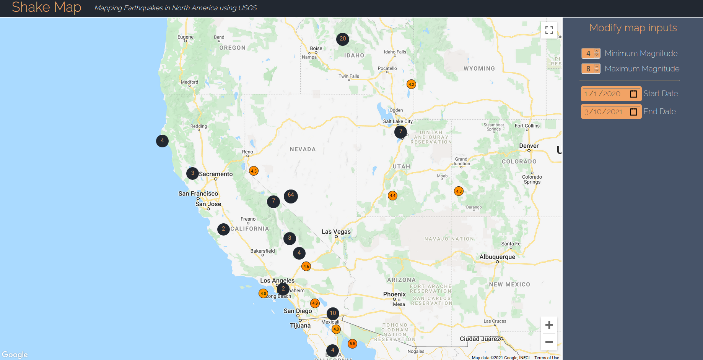

# shake-map

A React-enabled visualization of 2020 earthquake data in North America from [USGS Earthquake Catalog API](https://earthquake.usgs.gov/fdsnws/event/1/), spatially rendering points using [google-map-react](https://www.npmjs.com/package/google-map-react). Remote data is fetched using [swr](https://www.npmjs.com/package/swr), and data is clustered using the [useSupercluster](https://www.npmjs.com/package/use-supercluster) hook for [supercluster](https://github.com/mapbox/supercluster).

## Parameters
The user can modify the `minmagnitude`, `maxmagnitude`, `starttime`, and `endtime` parameters by using the inputs.

`minlatitude`: 24.396308

`minlongitude`: -124.848974

`maxlatitude`: 49.384358

`maxlongitude`: -66.885444

The current date is retrieved from the browser and submitted as the `endtime` parameter.

[Check it out live](https://shakemap-react.herokuapp.com/)
